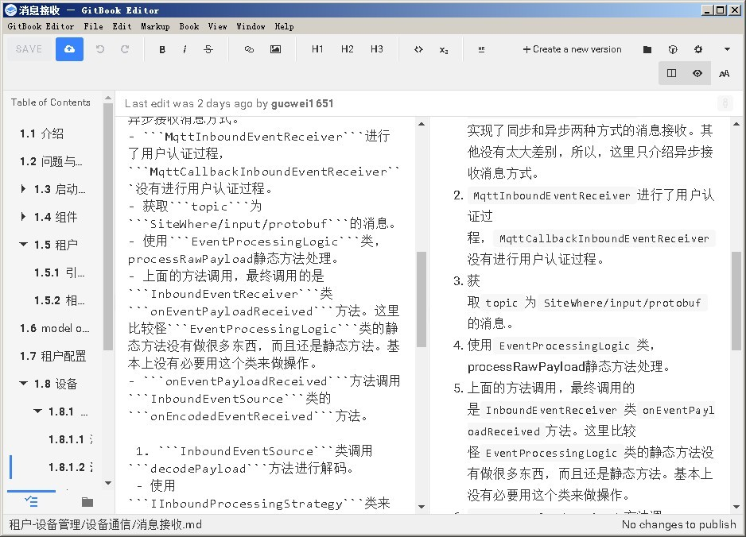
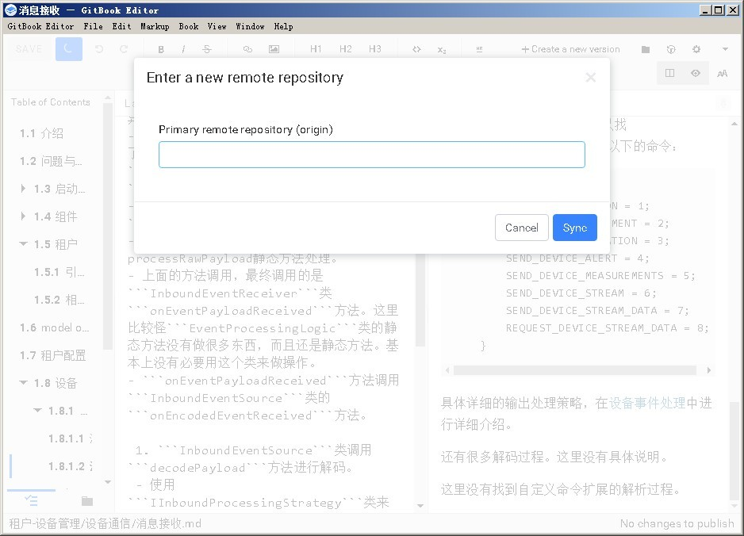
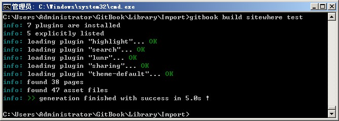
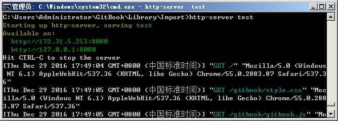
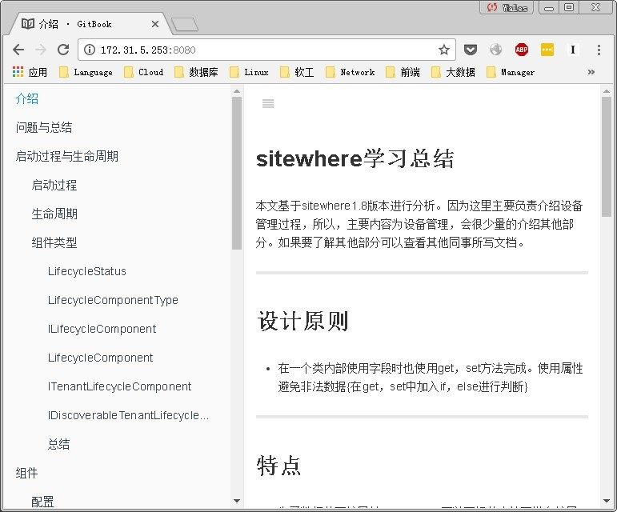

# 使用[GitBook] [1]更便捷的发布你的文档

在软件过程中最终要的是**沟通**，这样我们就要解决在软件过程中发生的各种有碍沟通的问题。其中，最让人头疼的就是各方人员知识结构不同，术语不同，注意的方向不同所造成的的问题。必须有一种规则来指定系统中所有的术语与语境的统一。（DDD的统一语言）

还有软件系统在开发过程中因为各方信息来源不同所造成的的信息版本不一致的问题。这样也很影响软件的开发与维护过程。为了解决这些问题最好的办法就是有一个专门维护项目资料与过程的在线系统。在任何一个关于软件系统的知识发生变化之后，马上更新到现在系统中。这样很大的降低了我们团队的沟通成本。

在这里介绍使用GitBook来更便捷，更简单的发布我们的文档。

## 介绍

GitBook是一个类似github的书籍网站，使用Markdown语法来简化文档格式描述。可以将Markdown文档导出为html，pdf，ebook等格式，有自己所见即所得的文档编辑工具。由于使用纯文本方式进行格式化文档编写，所以，编写项目文档类很容易，进行版本控制也很容易。

Markdown相信很多同学都听说过。**Markdown是一种轻量级标记语言，这个语言的目的是希望大家使用“易于阅读、易于撰写的纯文字格式，并选择性的转换成有效的 XHTML (或是HTML)”**。

## 使用

GitBook有两种使用方式。一种是本地化使用，可以通过编辑工具，命令行工具在本地搭建GitBook服务。另外一种是直接使用[GitBook] [1]网站服务发布自己的文档或博客等。

我们这里只介绍本地化的使用方法。直接使用GitBook服务在编辑工具中集成了很多基本使用一番就可以摸清，这里就不详细介绍了。

1. 首先下载并安装[GitBook Editor] [3]工具，**免费，离线，支持Git的Markdown工具。丰富的目录，章节管理**功能。我都准备拿它做我的知识管理工具了。


- 因为我们的文档是使用Markdown来编写的，所以，在对Markdown文档进行版本控制很方便。不像我们之前使用word的方式那样难以维护。这里我使用一种比较流行的方式来完成文档的版本管理。
 - 使用GitHub作为版本仓库。来维护我们的文档版本，方便在一些情况下调查版本更改。
 - 使用在线GitBook服务时可以直接指定你的Book所关联的GitHub仓库。并设置WebHook，在每次将文档提交到GitHub之后，GitBook都会重新构建一遍Book进行发布。这样省去了我们很多手动的工作。
 - 在[GitBook Editor] [3]中直接支持Git仓库，所以，使用[GitBook Editor] [3]可以直接提交到GitHub的仓库中。可以在下图中直接填仓库的url即可。


- 编译发布文档，使用本地服务发布的方式其实很简单。因为GitBook本地编译与发布工具使用的是Node.js来完成，所以，都是脚本。弄起来就简单了。
 - 下载并安装[Node] [6]
 - 使用npm安装GitBook
``` $ npm install gitbook -g ```
 - 安装完成之后即可使用```gitbook help```获取命令行帮助。

 - 发布服务

 - 查看网页


其实GitBook发布在线文档相当的简单。基本这几部就完成了，之后就不需要动什么东西。比较麻烦一点就是需要动态发布，这也其实也简单，只需要在GitHub中配置一个提交hook脚本，每次自动执行以上几个步骤就可以。

在整个文档编写与发布过程中最麻烦的是文档内容的组织。这个可以说是仁者见仁智者见智的地方。我一般情况下这样组织文档结构：

- 文档名
 - .gitignore 在提交时忽略变更的文件列表。
 - book.json 一般不会使用
 - README.md 文档的整体性介绍
 - SUMMARY.md 文档的目录
 - GLOSSARY.md 词汇表
 - sytle.css 全局样式文件，一般不用，除非要制定一些全局性的样式，比如说水印
 - 章节目录 一般情况下，我会将每一个章节创建一个目录，这样方便管理。如果有自章节也使用章节目录的方式来完成。
   - README.md 章节的内容
   - 其他文件 章节内容所引用的其他文件，比如：图片，资源等

## 后话

我所知的支持Markdown的Blog还有[简书] [5]，Coding，GitHub等等。要不是因为是国内的服务，要不是因为支持不完善等等。我最终选择了GitBook。[简书] [2]是一个很好的地方，支持完善的markdown，还支持很多其他的，并且支持现在很流行的知识变现。但是因为他是国内的东西，所以让他的可信度立马降低到很低。GitHub可以使用GitHub Pages做自己的博客使用，只不过所有介绍GitHub Pages的地方都在用生成静态界面的方式来完成，过于繁琐。所以，最终都还是选择了[GitBook] [1]。

我的GitBook账号是:[guowei1651] [2]，我会时不时的在上面更新一些Blog，请大家关注哦。

本文档使用[GitBook Editor] [3]编辑。

[1]: https://www.gitbook.com "GitBook"
[2]: https://guowei1651.gitbooks.io "guowei1651"
[3]: https://www.gitbook.com/editor "GitBook Editor"
[4]: https://zh.wikipedia.org/wiki/Markdown "Markdown"
[5]: http://www.jianshu.com/ "简书"
[6]: https://nodejs.org/en/#download "Node"